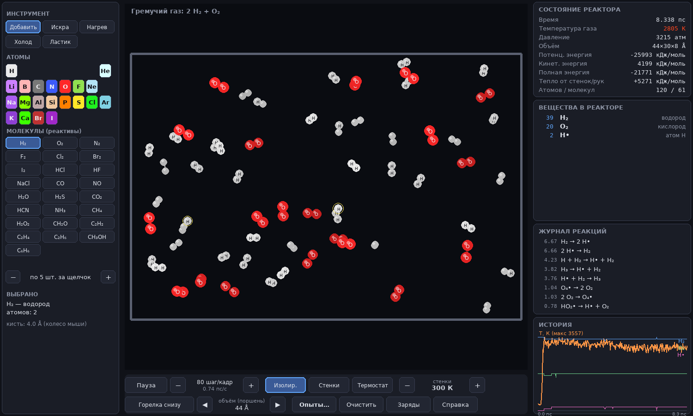
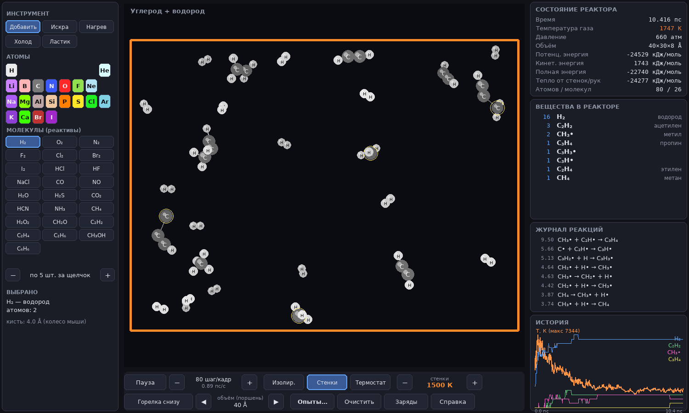

# Химический симулятор

Песочница, в которой **химия вытекает из физики**. В коде нет ни одного правила вида
«смешал A и B — получил C». Атомы — это частицы, которые движутся по законам Ньютона
в поле потенциальной энергии. Эта энергия построена только из табличных свойств
элементов: электроотрицательности, ковалентных радиусов, энергий связей и
ван-дер-ваальсовых параметров. Молекулы, радикалы, цепные реакции, тепловые
взрывы, металлы и соли возникают сами — или не возникают, если так велит энергия.



*Гремучий газ после нескольких искр: радикалы (жёлтые кольца), журнал элементарных
реакций, рост температуры. Ни одна из реакций в журнале не записана в коде.*



*Из отдельных атомов C и H при 1500 К сами собрались ацетилен, этилен, пропин,
метан и метильные радикалы — типичный набор продуктов высокотемпературного пиролиза.*

---

## Быстрый старт

```bash
pip install -r requirements.txt     # numpy, numba, pygame
python main.py                      # игра
```

Первый запуск занимает ~30 секунд: numba компилирует физическое ядро в машинный
код. Потом результат берётся из кэша, и запуск мгновенный.

Без графики:

```bash
python -m chemsim run --scenario knallgas --sparks 4 --time 10     # опыт в терминале
python -m chemsim run --mix "CH4:12,O2:24" --temp 3500 --mode isolated --time 5
python -m chemsim validate --md report.md    # сравнение модели с экспериментом
python -m chemsim scenarios                  # список готовых опытов
python -m chemsim elements --pair C-O        # параметры связи C–O и откуда они взялись
python -m pytest                             # тесты (55 шт., ~20 с)
```

## Управление

| Действие | Как |
|---|---|
| Положить вещество | выбрать атом/молекулу слева → ЛКМ в реакторе |
| Искра (разряд, ~25 000 К) | ПКМ, или инструмент «Искра» |
| Нагреть / охладить область | инструменты «Нагрев» / «Холод», держать ЛКМ |
| Убрать атомы | «Ластик» |
| Размер кисти | колесо мыши |
| Пауза / скорость | Пробел, `+` / `−` |
| Температура стенок | `[` / `]` (с Shift — шаг 500 К) |
| Режим теплообмена | `M`: изолированный сосуд / тёплые стенки / термостат |
| Поршень (объём) | `←` / `→` |
| Раскраска по зарядам, связи, подписи | `Q`, `B`, `L` |
| Готовые опыты, справка, снимок экрана | `O`, `H`, `S` |

Готовые опыты задают **только реактивы и условия** (что положить, какая
температура): гремучий газ, горение метана, H₂ + Cl₂, H₂ + F₂, синтез аммиака,
натрий в хлоре, «первичный бульон» Миллера–Юри, углерод + водород, вода,
благородные газы. Что получится — решает физика.

---

## Как это устроено

### Единицы и динамика

Длина — Å, время — фс, масса — а.е.м., энергия — кДж/моль. Уравнения Ньютона
интегрируются симплектическим скоростным алгоритмом Верле. Шаг адаптивный: ни один
атом не смещается за шаг больше чем на 0.025 Å. Кроме того, шаг «под контролем
энергии»: если за шаг полная энергия изменилась больше чем на 2 кДж/моль, шаг
повторяется с вдвое меньшим dt. В изолированной системе полная энергия сохраняется
(дрейф < 0.03 % за 2 пс), поэтому тепло реакций никуда не девается: оно
превращается в скорость атомов, то есть в температуру.

Температура — средняя кинетическая энергия, `T = 2⟨E_кин⟩ / (3N·k_B)`.
Давление — средняя сила ударов о стенки на единицу площади.
Теплообмен — ланжевеновский термостат только в слое у стенок (газ нагревается и
остывает, ударяясь о стенки заданной температуры) или во всём объёме.

Реактор — «толстый слой» 3D (по умолчанию 44×30×8 Å). Молекулы трёхмерные
(тетраэдрический CH₄, изогнутая H₂O), а на экран выводится проекция.

### Потенциальная энергия

Энергия системы — сумма вкладов, у каждого из которых ясный физический смысл:

```
E = Σ_пар [ R1(r) − (bσ + τ)·A1(r) − h1(bπ)·P(r) − h2(bπ)·Q(r)
            + (1−zL)(1−α∨)·E_отт(r) + E_дисп(r) + (1−z)·k_e·q_i·q_j·u(r) ]
  + Σ_углов K·bσ·bσ'·(cos θ − cos θ₀)²  − исключения 1-3 (и ½ кулона 1-4)
```

**1. Химическая связь — потенциал Морзе в форме Абелла–Терсоффа.**
`R1 = D·e^(−2a(r−r1))`, `A1 = 2D·e^(−a(r−r1))`. У изолированной пары `R1 − A1` —
это ровно кривая Морзе с экспериментальными энергией `D`, длиной `r1` и жёсткостью
связи. Отталкивание `R1` действует всегда (принцип Паули), а притяжение
умножается на **порядок связи** `bσ`, который зависит от окружения.

**2. Валентность из «насыщения», а не из правил.** Порядок σ-связи
`bσ_ij = z(r)·min(f_ij, f_ji)`, где `f_ij = (Z_ij/V_i)^(−δ)` при `Z_ij > V_i`.
Здесь `V` — валентность атома, `Z` — число соседей в первой координационной сфере.
Если соседей больше, чем позволяет валентность, связи ослабевают и удлиняются — это
закон Полинга–Абелла, на котором построены потенциалы Терсоффа и Бреннера.
Поэтому CH₅, H₃O, H₃ нестабильны, а CH₄, H₂O, NH₃ стабильны. При подсчёте соседей
учитывается геометрия: партнёры под острым углом конкурируют сильнее
(`g = 1 + 6·cos²θ`, как угловая функция Терсоффа). Кроме того, более слабая связь
не может отнять валентность у более прочной (подход BEBO).
Показатель `δ = 0.55` для неметаллов подобран по барьеру эталонной реакции
H + H₂ → H₂ + H. Он и ещё несколько констант модели (жёсткость углов, коэффициент
острых углов, сжатие угла неподелённой парой, δ ионной связи) — **общие для всех
элементов**. Отдельных параметров для конкретных веществ или реакций нет.
Константы собраны в `ModelSettings` (`chemsim/params.py`) и в начале
`chemsim/kernel.py`, у каждой указано, откуда взялось значение.

**3. Кратные связи.** Валентность, не занятая σ-связями, распределяется между
соседями, у которых она тоже есть. Так сами возникают двойные (O₂, C₂H₄, CO₂) и
тройные (N₂, C₂H₂, HCN) связи, ароматические «полуторные» связи бензола и радикальные
центры. Энергия π-связей `P(r)`, `Q(r)` — экспоненты, коэффициенты которых
находятся из условия: минимум при порядке 2 лежит ровно на экспериментальных
`(r₂, D₂)`, при порядке 3 — на `(r₃, D₃)`.

**4. Радикалы.** Атомы со свободной валентностью притягиваются по «хвосту» кривой
Морзе и рекомбинируют без барьера (`τ`). Хвост ограничен свободной валентностью и
делится между несколькими радикальными партнёрами. Насыщенные молекулы при
сближении отталкиваются (`E_отт`, UFF), и реакция между ними требует энергии
активации. Барьеры (H + H₂, CH₄ + H, OH + H₂ …) не задаются — они получаются из
того, как одна связь ослабевает, пока образуется другая.

**5. Углы — теория VSEPR.** Стерическое число `SN = (σ-связи) + (неподелённые
пары)`, `cos θ₀ = −1/(SN − 1)` (180°, 120°, 109.5°), а каждая неподелённая пара
чуть сжимает угол. Отсюда H₂O ≈ 104.5°, NH₃ ≈ 107°, CO₂ — 180°.

**6. Заряды и электростатика.** По каждой связи на менее электроотрицательный атом
переходит доля заряда `I = 1 − exp(−Δχ²/4)` (ионный характер по Полингу),
нормированная на валентность. Кулон считается по схеме DSF (Fennell & Gezelter,
2006): энергия и сила плавно обнуляются на радиусе обрезания, и нейтральные молекулы
не видят «ложных» зарядов. Для связанных пар и пар 1-3 кулон исключён: ионный
вклад уже учтён в энергии связи (уравнение Полинга). Из электростатики получаются
водородные связи и притяжение ионов.

**7. Ионные кристаллы и металлы.** Ионная и металлическая связи ненаправленные:
для них `δ` меньше (0.3). Для металлов это следует из энергии когезии
(приближение второго момента), для ионных связей δ смешивается пропорционально
ионности. Энергия связи M–M для металлов берётся из экспериментальной энергии
когезии кристалла. У металлов есть электроны проводимости, поэтому паулиевского
отталкивания замкнутых оболочек у них нет (натрий «горит» в хлоре).

### Откуда берутся параметры

| Величина | Источник |
|---|---|
| массы | IUPAC 2021 |
| электроотрицательность | шкала Полинга |
| ковалентные радиусы (одинарная/двойная/тройная) | Pyykkö & Atsumi, Chem. Eur. J. 2009 |
| ван-дер-ваальсовы параметры | UFF, Rappé et al., JACS 1992 |
| энергии и длины связей | CRC Handbook, Huheey «Inorganic Chemistry», Luo 2007 |
| неизвестные пары | уравнение Полинга `D(AB) = ½[D(AA)+D(BB)] + 96.5·Δχ²` + радиусы Пюккё |
| жёсткость связи (параметр Морзе) | правило Баджера `k·(r − d_ij)³ = 1.86` мдин·Å² |
| металлы | энергии когезии (Kittel) |

Посмотреть, как получена любая связь: `python -m chemsim elements --pair N-O`.

---

## Насколько это «как в жизни»: проверка

`python -m chemsim validate` минимизирует энергию молекул и сравнивает с
экспериментом (полный отчёт — [docs/validation.md](docs/validation.md)). Модель не
знает ни одной реакции, все теплоты реакций получаются из энергий отдельных молекул.

| | модель | эксперимент |
|---|---:|---:|
| энергии атомизации 23 молекул | средняя ошибка 2.5 % | — |
| длины связей | ±0.01–0.04 Å | — |
| угол H–O–H | 104.5° | 104.5° |
| угол H–N–H | 107° | 106.7° |
| 2 H₂ + O₂ → 2 H₂O, ΔH | −487 кДж/моль | −484 |
| CH₄ + 2 O₂ → CO₂ + 2 H₂O | −798 | −802 |
| H₂ + Cl₂ → 2 HCl | −182 | −185 |
| H₂ + F₂ → 2 HF | −539 | −547 |
| барьер CH₄ + H → CH₃ + H₂ | 51 | ≈55 |
| барьер H + H₂ → H₂ + H | 62 | ≈40 |
| (NaCl)₂: энергия димеризации | −227 | ≈ −190 |
| CH₅, H₃O, NH₄, H₃, H₄ | нестабильны ✓ | нестабильны |

Что возникает само (проверено тестами и опытами):

* цепной механизм горения водорода: H₂ → 2H•, H• + O₂ → OH• + O•, O• + H₂ → OH• + H•,
  OH• + H₂ → H₂O + H•, H• + O₂ → HO₂•;
* разогрев изолированного газа экзотермическими реакциями, тепловой взрыв;
* инертность благородных газов при любой температуре и азота при умеренной;
* сборка углеводородов из атомов C и H; конденсация паров натрия в металлические
  кластеры; образование NaCl и ионных кластеров; водородные связи воды.

## Честные ограничения

Это классическая (не квантовая) модель — компромисс между «по-настоящему» и
«работает в реальном времени на ноутбуке». Сознательные упрощения:

* **Нет спина и возбуждённых состояний.** O₂ описан как обычная двойная связь, а не
  как бирадикал-триплет, поэтому H• + O₂ → HO₂• идёт с небольшим барьером
  (≈25 кДж/моль вместо 0). Нет фотохимии и света.
* **Фиксированная валентность главных групп.** Нет гипервалентных соединений (SO₂,
  SO₃, H₂SO₄, PCl₅) и донорно-акцепторных связей (у CO модель даёт двойную связь:
  −26 % энергии), озон нестабилен.
* **Барьеры полуколичественные.** Для экзотермических отрывов атома H галогенами и
  OH модель завышает барьер в 2–4 раза (F + H₂: 23 вместо ≈6 кДж/моль).
* **Водородные связи слабее реальных** (димер воды ≈ −5 вместо −21 кДж/моль): заряды
  по Полингу меньше эффективных зарядов моделей воды. Вода «конденсируется» только
  при ~100–150 К.
* **Масштаб времени и плотности.** Моделируются пикосекунды, и газ сжат до сотен
  атмосфер. Реакции, которые в пробирке идут секунды, здесь требуют более высоких
  температур (закон Аррениуса). Сосуд размером в нанометры гасит пламя (реальное
  расстояние гашения пламени H₂ ≈ 0.6 мм), поэтому для взрывов удобен
  изолированный режим.
* Металлы и ионные кристаллы описаны приближённо (энергия димеризации NaCl
  завышена на ~20 %, между катионами остаются слабые металлические связи).

Цифры ошибок в этом списке — не оценки «на глаз», а результаты `chemsim.validate`.

---

## Устройство проекта

```
main.py                 запуск игры
chemsim/
  elements.py           таблица элементов (свойства и источники)
  bonddata.py           экспериментальные энергии и длины гетероядерных связей
  params.py             вывод параметров потенциала из свойств элементов
  kernel.py             реакционное силовое поле: энергия + аналитические силы (numba)
  md.py                 список соседей, стенки, интегратор, термостат (numba)
  simulation.py         «реактор»: добавление/удаление атомов, искра, поршень, измерения
  molecules.py          реактивы (стартовые геометрии) и размещение в реакторе
  analysis.py           молекулы, формулы, журнал реакций
  names.py              русские названия веществ (только подписи на экране)
  scenarios.py          готовые опыты (только начальные условия)
  minimize.py           минимизация энергии (FIRE), профили реакций
  validate.py           сравнение с экспериментом
  cli.py                командная строка
  ui/                   интерфейс на pygame (+ шрифты DejaVu)
tests/                  55 тестов: силы vs численная производная, химия vs эксперимент,
                        сохранение энергии, анализ, возникающие реакции, интерфейс
```

Все производные энергии (силы) выведены вручную обратным проходом по цепочке
«расстояния → координация → порядки связей → заряды → энергия». Тесты сверяют их
с численной производной с точностью ~1e-9.

### Как добавить элемент

Добавьте строку в `ELEMENT_LIST` (`chemsim/elements.py`): масса,
электроотрицательность, валентность, ковалентные радиусы, параметры UFF, энергии
связей A–A, для металлов — энергия когезии. Известные энергии связей с другими
элементами можно добавить в `chemsim/bonddata.py`, а неизвестные будут оценены по
уравнению Полинга. Больше ничего не нужно: новый элемент сразу участвует во всей
химии.
